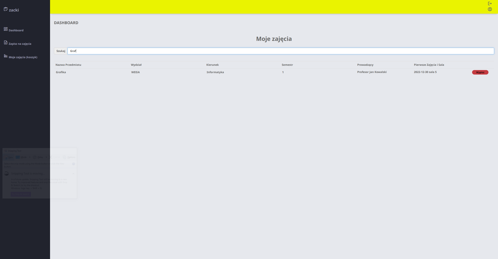

# RegistrationSystemForStudents
Project for iabd class

# Mainpage

# Login/Register

# Dashboard Sections

Admin and Client dashboard include sections, each with a different functionality.
The sections are shown and hidden with javascript, by modifing "display" property.
More of them can easily be implemented by adding a new div and open/close JS function.

# Responsive sidebar

# Realtime Search

# Profile Page

All data is fetched from the database.

# Technologies used
* mySQL database
* HTML and CSS
* PHP
* Ajax, JS, JQuery

# ⚠️Please Note

This project was created for a university course called web-based database applications. Copying it will most likely result in failing the course.
